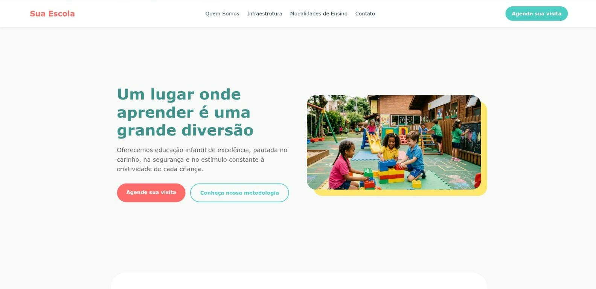

# 🎓 Site Escolar

Projeto de site institucional desenvolvido com o objetivo de apresentar uma escola de forma organizada, moderna e acessível.

## 📌 Sobre o projeto

Este projeto foi criado como parte de uma atividade escolar, com foco na prática de desenvolvimento web utilizando HTML e CSS.

O site simula a página de uma escola, contendo informações como metodologia de ensino, estrutura e formas de contato, com uma navegação simples e intuitiva.

## 💻 Tecnologias utilizadas

* HTML5
* CSS3

## 🎯 Funcionalidades

* Página inicial com apresentação da escola
* Seção de metodologia de ensino
* Menu de navegação entre páginas
* Layout organizado e responsivo
* Rodapé com informações de contato

## 📷 Preview

<p align="center">
  
</p>

## 🚀 Como visualizar o projeto

1. Baixe ou clone este repositório:

   ```bash
   git clone https://github.com/seu-usuario/seu-repositorio.git
   ```

2. Abra o arquivo:

   ```
   index.html
   ```

3. Visualize diretamente no navegador.

## 📚 Aprendizados

Durante o desenvolvimento deste projeto, pratiquei:

* Estruturação de páginas com HTML
* Estilização com CSS
* Organização de layout
* Criação de interfaces simples e funcionais


## 👩‍💻 Autora

Desenvolvido por Giovanna Campos
